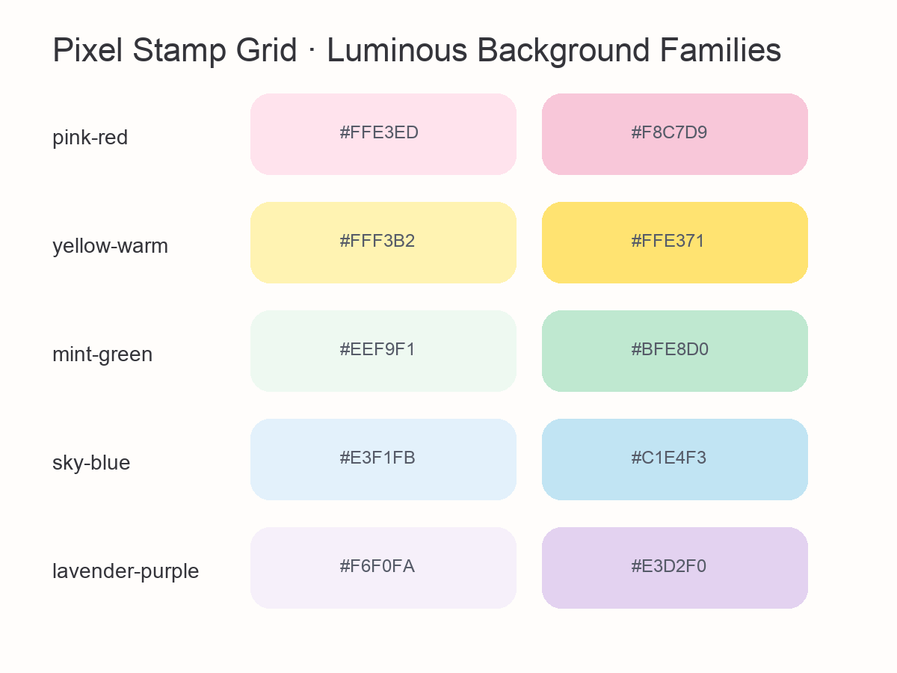

# Pixel Stamp Grid

把 **4 张真实照片**转换成一组适合竖版社交媒体发布的像素邮票海报。

Skill 会保留每张照片的主体、视角和主要构图，自动识别整组照片的第一主色与第二主色，并稳定输出两张协调但不同的海报：

- 第一主色：波点背景
- 第二主色：固定 18 条竖纹背景
- 2 × 2 邮票布局，每枚邮票每边固定 12 个半圆齿孔
- 2048 × 2732 竖版画幅
- 默认保留生成图块原色，避免二次量化产生统一色偏
- 自动生成有图像依据的三词英文主题
- 平面数字像素风，不生成簇绒、毛毯、刺绣或厚重材质效果

> English summary: A Codex skill that turns exactly four photographs into two coordinated 2-by-2 pixel-art postage-stamp posters, using source-derived colors and deterministic layout, typography, and validation.



## 它解决什么问题

单靠一条长提示词生成整张海报，常出现主体走样、四格风格不统一、花边数量随机、文字拼错、背景色与原图无关等问题。本 Skill 把任务拆成可检查的三个阶段，让容易漂移的创意转换与必须稳定的排版规则分开执行。

## 工作原理：三步 SOP

### 1. 分析与转换

1. 检查四张原图方向和排序。
2. 从原图识别第一、第二主色族，仅用于海报背景。
3. 分别生成四张无边框正方形像素插画，保留主体、视角、轮廓和构图锚点。
4. 默认保留生成图块原色；只有图块像素网格不稳定时才独立量化，用户明确要求强统一时才启用共享色板。

### 2. 主题与排版

1. 汇总四图共同出现的颜色、氛围和场景证据。
2. 生成并校验三个英文主题候选，自动选择一个严格的三词标题。
3. 使用内置 Allura 字体排版，文字颜色根据背景色自动选择。
4. 生成主色波点版与次主色 18 条纹版。

### 3. 验收与定点修改

自动检查：

- 两张输出是否齐全
- 画幅是否为 2048 × 2732
- 四张内容是否存在
- 每枚邮票每边是否为 12 个半圆
- 条纹是否恰好为 18 条
- 背景是否来自原图主色
- 主题文字是否已经排入海报

如果失败，只回到最早出错的阶段修改，避免整套流程重做。

## 色彩判断逻辑

Skill 不固定使用黄色、粉色或蓝色。它会先从四张原图中统计共享色彩，再按跨图片支持度、面积和显著性排列：

1. 第一主色生成波点版。
2. 第二主色生成条纹版。
3. 背景色保留原主色的色相族，但转换为高明度、清亮的马卡龙色。
4. 绿色和紫色使用动态色相保护，避免背景偏灰。
5. 图块颜色与背景颜色默认解耦，不做第二次全局调色。
6. 如果用户明确要求共享色板，则使用至少 24 色，并在出现主体串色时自动退回原色模式。

目前内置的高亮背景族包括粉红、暖黄、薄荷绿、天空蓝和薰衣草紫；实际使用时会根据原图调整色相与色度，而不是机械套预设。

## 安装

### 方法一：直接让 Codex 安装

把下面这句话发给 Codex：

```text
请从 https://github.com/7upradday/create-pixel-stamp-grid 安装 skill/create-pixel-stamp-grid 这个 Skill。
```

### 方法二：手动安装

```bash
git clone https://github.com/7upradday/create-pixel-stamp-grid.git
cp -R create-pixel-stamp-grid/skill/create-pixel-stamp-grid ~/.codex/skills/
```

安装后新开一个 Codex 对话，或重新加载 Skill 列表。

辅助脚本使用 Python 3 和 Pillow。Codex Desktop 的工作区运行时通常已经包含这些依赖；手动运行脚本时可安装：

```bash
python3 -m pip install -r requirements.txt
```

## 怎么用

上传或提供恰好四张照片，然后直接调用：

```text
使用 $create-pixel-stamp-grid，把这四张照片做成像素邮票四宫格海报。
保持原图主体与构图，输出主色波点版和次主色 18 条纹版，并自动加入英文主题。
```

如果构图需要额外控制，可以这样说：

```text
使用 $create-pixel-stamp-grid 处理这四张照片。
第 1、3 张主体放在上三分之一，第 2、4 张保持居中；人物和细节较多的图片使用 64 × 64 逻辑像素。
```

如果不想要主题文字：

```text
使用 $create-pixel-stamp-grid 处理这四张照片，theme: off。
```

## 输入要求

- 必须恰好四张图片。
- 最好提供原始照片，不要先截图或反复压缩。
- 四张图按左上、右上、左下、右下的顺序提供。
- 主体可以居中或位于画面上三分之一。
- 如果主体很小、被遮挡或严重模糊，生成后的识别度也会下降。

## 默认输出

一次运行通常返回：

```text
pixel-stamp-primary-dots.png
pixel-stamp-secondary-stripes.png
palette-preview.png
palette.json
composition-manifest.json
validation-report.json
theme-evidence.json
```

其中两张 PNG 是最终社交媒体稿，其余文件用于说明配色来源和验收结果。

## 稳定性设计

- 不让图像模型一次生成整张海报。
- 每张照片单独转换，默认保留通过视觉检查的生成色彩。
- 花边、网格、背景图案和文字全部由脚本确定性绘制。
- 文字不交给图像模型生成，避免拼写错误。
- 背景色从原始照片提取，而不是从已经风格化的结果反推。
- 输出前执行结构化验收，并保存清单和报告。

## 项目结构

```text
.
├── README.md
├── requirements.txt
├── docs/
│   └── palette-bank.png
└── skill/
    └── create-pixel-stamp-grid/
        ├── SKILL.md
        ├── agents/openai.yaml
        ├── assets/
        ├── references/
        └── scripts/
```

## 隐私说明

仓库不包含测试过程中使用的个人照片或用户素材。运行 Skill 时，图片只用于当前任务流程；是否保存或分享输出由使用者自行决定。

## License

代码与文档采用 [MIT License](LICENSE)。内置 Allura 字体依据 [SIL Open Font License](skill/create-pixel-stamp-grid/assets/OFL-Allura.txt) 分发。
